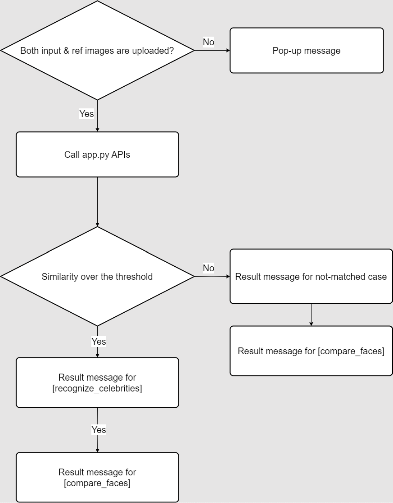

# Cloud-Computing-Term-Project-17

- [A. 프로젝트 명](#a-프로젝트-명)
- [B. 프로젝트 멤버 이름 및 멤버 별 담당한 파트 소개](#b-프로젝트-멤버-이름-및-멤버-별-담당한-파트-소개)
- [C. 프로젝트 소개](#c-프로젝트-소개)
- [D. 프로젝트 필요성 소개](#d-프로젝트-필요성-소개)
- [E. 관련 기술/논문/특허 조사 내용 소개](#e-관련-기술논문특허-조사-내용-소개)
- [F. 프로젝트 개발 결과물 소개](#f-프로젝트-개발-결과물-소개)
- [G. 개발 결과물을 사용하는 방법](#g-개발-결과물을-사용하는-방법)
- [H. 개발 결과물의 활용방안 소개](#h-개발-결과물의-활용방안-소개)

## A. 프로젝트 명

AWS Rekognition을 활용한 닮은꼴 연예인 찾기 서비스

## B. 프로젝트 멤버 이름 및 멤버 별 담당한 파트 소개

- 조찬형:
  - 프론트엔드 구축
  - AWS Rekognition 기본 제공 모델을 수정하기 위한 이미지 크롤링
  - 데이터베이스 구축

- 허치영:
  - 벡엔드 서버 구성
  - 이미지 업로드 API 수정 및 추가 작성
  - AWS Rekognition 호출 및 응답 처리 후 clinet side 전송 구현
  - 추론 결과 확인 구현 (결과 인물 URL에서 인물 사진 출력)

- 한지훈:
  - 서비스 세부사항 수정 및 개선
  - 구축된 데이터베이스를 기반 AWS console을 이용하여 기존 모델을 재학습 및 fine-tuning
  - Local에서 모델 실험 및 결과 확인
  - AWS Rekognition SDK 수정하여 서비스 개선
  - Ref input과 유사도 측정 API 구현 및 수정

## C. 프로젝트 소개

 본 프로젝트는 AWS의 인공지능 서비스인 Rekognition을 활용하여 사용자가 제공한 사진과 유사한 연예인을 찾아주고, 추가적으로 사용자가 제공하는 Refeference image와 얼굴 유사도를 측정하는 서비스를 개발한다. 사용자는 웹 인터페이스를 통해 자신의 사진을 업로드하며, 시스템은 이를 분석하여 닮은꼴 연예인의 정보와 유사도 점수(%)를 제공한다.

 AWS Rekognition에서 기본적으로 제공하는 celebrity database와 recognize_celebrities API 호출을 위한 예측 모델만을 활용해서 서비스를 구현하는 과정, 즉 중간 결과 보고 까지의 진행 과정 중에서 다음과 같은 문제점이 있다.

1) Database에 존재하지 않는 연예인에 대해서는 대응하는 결과가 나오지 않는다.
2) 유사도가 특정 threshold를 넘지 않을 경우 해당 API는 empty list만을 return 한다.

 위와 같은 문제점들을 해결하기 위해서, 다음과 같은 방법을 시도했다.

1) 새로운 데이터베이스 구축을 위해 연예인 이미지를 크롤링 하고, AWS Rekognition에서 제공하는 tool을 통해 custom label들을 모델에 재학습한다.
2) AWS Rekognition SDK를 local에 다운로드하여 직접 코드를 수정해서 사용한다.

 하지만, 위 두가지 방법은 각각 custom label을 이용해서 재학습을 할 경우 프리 티어를 사용하기 때문에 비용 문제가 추가적으로 발생, AWS Rekognition은 내부적으로 모델 내에서 threshold를 설정하기 때문에 수정이 불가능하다는 이유로 해결이 되지 않았다.

 이와 같은 이유로, 기존 서비스에서 database에 대응 되는 연예인이 존재하지 않거나, 유사도가 너무 낮아서 결과를 확인할 수 없는 경우를 해결하기 위해서, ‘detect_face’와 ‘compare_face’를 이용해서 사용자로부터 input image와 reference image를 추가적으로 받아서 두 이미지에서 인물간의 유사도를 측정하는 기능을 추가해서, 사용자가 닮았다고 생각되는 Ref image에 대해 유사도를 결과로 확인할 수 있게끔 서비스를 수정하였다.

다음은 프로젝트가 하는 주요 기능들이다.

- 이미지 업로드: 사용자가 사진을 업로드할 수 있는 인터페이스를 제공한다.
- 이미지 분석: Amazon Rekognition을 통해 업로드된 이미지를 분석한다. 분석한 얼굴을 인식하고 특징을 추출한다.
- 유사도 계산: 추출된 얼굴 특징을 데이터베이스에 저장된 유명인 이미지와 비교 및 사용자의 Ref image와 비교 하여 유사도를 계산한다.
- 결과 표시: 유사도가 높은 순으로 닮은 유명인들 중에서 가장 높은 결과를 표시한다. 표시된 유명인의 이름, 유사도 점수, 관련 URL 정보 및 유명인 사진을 제공한다.

이러한 프로젝트를 사용함에 따라 사용자는 재미와 흥미를 느끼며 자신과 닮은 유명인을 찾아볼 수 있다. 또한, AWS Rekognition에서 제공하는 API, SDK를 통해 얼굴 인식 기술을 활용한 다양한 분야에 대한 가능성을 확인할 수 있다.

## D. 프로젝트 필요성 소개

 현대 사회에서는 이미지와 영상을 통한 정보 공유가 급증하고 있다. 개인의 이미지와 유명인의 이미지를 비교하여 유사도를 찾는 것은 사람들에게 충분한 재미를 제공할 수 있다. 이러한 기술은 단순한 재미를 넘어서 다양한 분야에서 활용될 수 있다.

- 필요성 1: 소셜 미디어와 엔터테인먼트

 소셜 미디어 플랫폼에서는 사용자가 자신의 사진을 업로드하고 유명인과의 유사도를 찾아 공유하는 컨텐츠들이 있다. 이는 사용자 참여를 높이고 플랫폼의 활성화와 문화 발전에 기여한다. 또한 유명인 닮은꼴 찾기는 사용자 간의 대화 주제가 될 수 있으며, 소셜 네트워크의 연결성을 강화한다.

- 필요성 2: 마케팅과 광고

 마케팅 캠페인에서 고객 참여를 유도하기 위한 도구로 활용될 수 있다. 예를 들어, 사용자가 자신의 닮은꼴 유명인을 찾고 이를 기반으로 맞춤형 광고를 제공하면, 사용자에게 더 큰 호응을 얻을 수 있고, 브랜드 이미지와 관련된 유명인과 사용자의 유사도를 활용한 캠페인은 브랜드 인지도를 높이고 고객의 충성도를 강화할 수 있다.

- 필요성 3: 교육과 연구

 이미지 분석 기술은 교육 및 연구 목적으로도 활용될 수 있다. 학생들은 얼굴 인식 및 비교 알고리즘을 학습하고 실습할 수 있으며, 이를 통해 딥러닝과 이미지 처리 기술에 대한 이해를 높일 수 있다. 그리고 연구자는 새로운 알고리즘이나 모델을 개발하고 평가하는 데 이 프로젝트를 실험적 도구로 사용할 수 있다. 추가적으로 AWS에서 제공하는 AI/ML Tool 에서 Rekognition의 다양한 API를 호출하여 서비스를 제공하는 예시 데모 및 서비스로 활용이 가능하다.

- 필요성 5: 개인화 서비스

 개인화 서비스 제공을 위한 기술로도 활용될 수 있다. 예를 들어, 사용자가 자신의 사진을 업로드하고 닮은꼴 유명인을 찾는 과정을 통해 개인 맞춤형 추천 서비스를 제공할 수 있다. 미용, 패션, 라이프스타일 관련 서비스에서는 사용자의 얼굴 특징을 분석하여 맞춤형 제품이나 스타일을 추천할 수 있다.

 본 프로젝트는 클라우드 컴퓨팅 서비스를 제공하는 대표적 퍼블릭 클라우드 서비스인 AWS에서 AI/ML tool에 속하는 Rekognition을 활용하여 단순하게 사용자의 재미 및 흥미를 위한 서비스를 개발한다. 이를 활용해서 마케팅 및 광고 분야나 다른 사업 분야에서도 십분 활용 가능한 확장성 및 실용성을 가지며, 사용자가 주관적으로 인지하는 수준에 유사하는 높은 신뢰도를 보여준다.

## E. 관련 기술/논문/특허 조사 내용 소개

1. Amazon Rekognition:
 Amazon Rekognition은 Amazon의 이미지 및 비디오 분석 서비스이다. 얼굴을 인식하고, 비교할 수 있다. 본 프로젝트에서는 Amazon Rekognition의 얼굴 비교 기능을 사용하였다. 이 기능은 사용자가 업로드한 이미지와 데이터베이스에 저장된 이미지 및 Ref image를 비교하여 결과를 도출하였다.

2. 관련 논문:
   - "DeepFace: Closing the Gap to Human-Level Performance in Face Verification" (Taigman et al., 2014): 딥러닝을 활용한 얼굴 인식 기술에 대한 논문으로, 인간 수준의 얼굴 인식 성능을 목표로 한다. 이 논문은 딥러닝 기반 얼굴 인식의 기초를 소개하기 때문에 재학습 및 fine-tuning 과정과 SDK를 수정하려는 시도에서 참고하였다.

   - "FaceNet: A Unified Embedding for Face Recognition and Clustering" (Schroff et al., 2015): 얼굴 인식 및 클러스터링을 위한 통합 임베딩 방법을 제시한다. 이 논문에서는 얼굴 특징을 고차원 공간에 임베딩하여 유사도 비교를 가능하게 하는 방법을 설명하기 때문에 마찬가지로  재학습 및 fine-tuning 과정과 SDK를 수정하려는 시도에서 참고하였다.

3. 특허 조사:
   - "Method and system for face recognition using a convolutional neural network" (US Patent 9,456,475): CNN을 활용한 얼굴 인식 시스템에 대한 특허로, 얼굴 특징을 추출하고 비교하는 방법을 소개한다.
   - "Face recognition method and device" (US Patent 10,123,456): 얼굴 인식 장치와 방법에 대한 특허로, 이미지 전처리 및 특징 추출 기술을 포함한다.

## F. 프로젝트 개발 결과물 소개


 위 다이어그램은 사용자가 웹 서비스를 통해서 유명 인사 닮은꼴을 찾는 시스템의 데이터 흐름에 대해 나타내었다.

1. User:

    사용자는 인물 얼굴 사진을 웹에 업로드하여 시스템에 제공한다.

2. UI:

    사용자 UI는 웹 페이지 형태로 구현되며, 사용자가 사진을 업로드하면, 서버로 전송하는
    역할을 한다.

3. WAS:

    웹 애플리케이션 서버는 사용자로부터 받은 이미지 데이터를 처리하고, 이미지 전처리
    과정후에 Amazon API Gateway로 전달한다. WAS는 이 서비스에서 사용자UI와 데이터 처리
    로직간을 중개하는 역할을 한다.

4. Amazon API Gateway:

    AWS 클라우드 내의 서비스로서, 외부 요청을 적절한 AWS 서비스로 라우팅한다. 이 서비스에서는 WAS의 요청을 받아서 Amazon Rekognition 서비스로 전달하는 역할을 한다.

5. Amazon Rekognition:

    AWS에서 제공하는 이미지 분석 서비스로, 이 서비스 에서는 업로드된 이미지 내의 얼굴을 분석해서 얼굴의 특징을 추출하고, 데이터베이스에 저장된 유명인사들의 얼굴 특징과 비교하여, 유사한 유명인사를 식별한 결과를 WAS로 다시 전송한다.
    각 client의 요청에 따라 다음과 같은 API를 호출한다.

5-1. 이미지 레이블 분석 요청:

- `recognize_celebrities(user_image)`

5-2. 이미지 유사도 분석 요청:

- `compare_faces(SourceImage, TargetImage, SimilarityThreshold)`

    이러한 구성을 가진 서비스는 사용자가 간편하게 웹 인터페이스를 통해 사진을 업로드하고, 빠른 시간 내에 결과를 받아볼 수 있다. 위와 같은 프로세스는 효율적인 데이터 처리와 빠른 응답 시간을 가능하게 하며, 추가적으로는 클라우드의 자동화된 스케일링과 관리 기능 덕분에 고가용성과 확장성을 보장한다.

    프로젝트에서 구현한 서비스의 플로우차트는 다음과 같다.



## G. 개발 결과물을 사용하는 방법

1. AWS 계정 설정 및 사용자 생성 (<https://docs.aws.amazon.com/ko_kr/rekognition/latest/dg/setting-up.html>)
2. AWS CLI 및 AWS SDK 설정 (<https://docs.aws.amazon.com/ko_kr/rekognition/latest/dg/setup-awscli-sdk.html>)
3. 레포지토리 클론

    ```shell
    git clone https://github.com/Huch0/Cloud-Computing-Term-Project-17.git
    ```

4. pip package 설치

    ```shell
    pip install -r requirements.txt
    ```

5. Flask 서버 실행

    ```shell
    cd server
    flask run
    ```

6. 브라우저로 접속

    <http://127.0.0.1:5000/>

## H. 개발 결과물의 활용방안 소개

1. 엔터테인먼트:

    소셜 미디어 플랫폼에서 사용자가 자신의 닮은꼴 유명인을 찾고 공유할 수 있다. 이는 사용자 참여를 높이고, 플랫폼의 활성화에 기여할 수 있다.

2. 마케팅:

    브랜드 캠페인에서 고객 참여를 유도하기 위해 사용될 수 있다. 예를 들어, 사용자가 자신의 닮은꼴 유명인을 찾고 이를 기반으로 한 맞춤형 광고를 제공할 수 있다.

3. 보안:

    얼굴 인식 기술을 활용하여 보안 시스템에 통합할 수 있다. 출입 통제 시스템이나 사용자 인증 과정에서 활용될 수 있다.

4. 교육:

    이미지 분석 기술을 학습하고 실습하는 데 유용하게 사용될 수 있다. 딥러닝과 이미지 처리 기술에 대한 전반적인 이해 뿐만 아니라, 퍼블릭 클라우드에서 제공하는 다양한 Tool과 SDK를 사용하는 방법에 대해 기본적인 Demo 형태로 사용할 수 있다.

5. 연구 개발:

    얼굴 인식 및 비교 알고리즘의 성능을 평가하고 개선하는 연구에 활용될 수 있다. 새로운 알고리즘이나 모델을 개발하는 데 실험적 도구로 사용할 수 있다.
